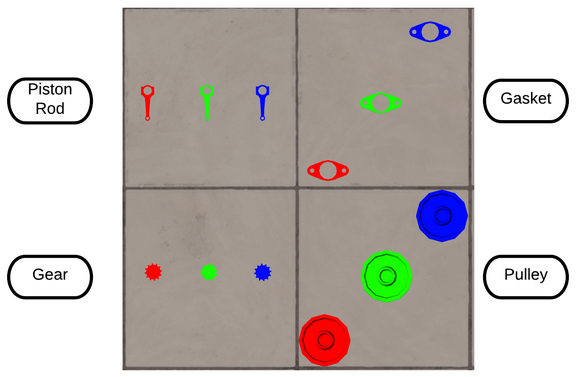

# ARIAC 2020
[](https://opensource.org/licenses/BSD-3-Clause)

[Agile Robotics for Industrial Automation](https://www.nist.gov/el/intelligent-systems-division-73500/agile-robotics-industrial-automation-competition) (ARIAC) is a simulation based competition organized by the National Institute of Standards and Technology (NIST) in Collaboration with IEEE CASE, every year since 2017.  The purpose of ARIAC is to investigate robot agility by utilizing the latest advances in artificial intelligence, robot planning and control. Specifically, ARIAC focuses on challenging robotic agility in manufacturing environments. This project is build around [ARIAC 2020](https://github.com/usnistgov/ARIAC/tree/ariac2020) competition, which is implemented in ROS Melodic and Gazebo 9.16 simulator.

## Team Members

- Sandeep Kota Sai Pavan - [LinkedIn Link](https://www.linkedin.com/in/skotasai/)
- Rodrigo Perez-Vicente - [LinkedIn Link](https://www.linkedin.com/in/rodrigodelazcano/)
- Anubhav Paras - [LinkedIn Link](https://www.linkedin.com/in/anubhavparas/)
- Vasista Ayyagari - [LinkedIn Link](https://www.linkedin.com/in/vasista-ayyagari-b559b8144/)

## Goal of ARIAC 2020 Challenge
The premise of ARIAC 2020 is to build kits of different types of products based on received orders from the system. To build this kits, a gantry robot with two UR10 arms attached to its torso and vacuum grippers can be moved around a warehouse to retrieve the parts from each order. These parts can be found in shelves and bins. The robot picks up the parts and places them on a specified AGV. Once a kit is completed, the AGV is shipped to fulfill an order. ARIAC 2020 presents the following agility challenges include high priority order, faulty parts, faulty gripper, flipped parts, sensor blackout and moving obstacles.  Some of the tools used for this competition include C++, ROS, Gazebo, MoveIt and ROS TF.

## ARIAC Environment

The environment consists of a gantry robot, 2 AGV’s on either side of the shop floor, multiple shelves and bins, a conveyor belt and moving obstacles. The parts are located within the bins and shelves. However, some parts also can spawn in the conveyor belt. The parts in the conveyor are in continuous motion and disappear when they reach the end of the belt. The shelves are arranged in a way to create four aisles. In each trial there are two moving obstacles that can be found in any of the aisles.


ARIAC Environment             |  Part Types
:-------------------------:|:-------------------------:
  |  


## Knowledge Representation
There are different kinds of knowledge representations based on the information we have, ranging from ordinary glossaries to general logic. Following is the knowledge model of the objects and behaviors implemented in our project. For each object in the project, appropriate attributes and behaviors are identified. To learn more about the architecture implemented please read the [final report](https://drive.google.com/file/d/1-XxIVknE4O_pLyZTwY1GoaqGvqv6Sk5j/view?usp=sharing) or have a look at the [presentation](https://drive.google.com/file/d/1EpHO7O77YrO4odJyRM18okfMnBBDxLN4/view?usp=sharing).
<p align="center">

</p>

## Agility Challeneges

ARIAC 2020 has the following agility challenges
1)  <b> Faulty Products :</b> Certain parts in the environment are faulty but can only be identified once placed on the trays. Only the quality control sensors above the AGV's can detect faulty parts. Faulty parts are taken from the trays and thrown to the floor. Both arms are used to retrieve new parts from the bins and shelves. Faulty parts are substituted until no more faulty parts are detected in both trays.
<p align="center">
  
</p>

2) <b> Flipped products :</b> Certain parts need to be flipped before placing them on the AGV. 
3) <b> Dropped Products :</b>  The gripper becomes faulty at various instances. This leads to either incorrect pose on the AGV or  may not be placed on the AGV at all.
4) <b> In-process order interruption :</b> In the middle of an order, another other is placed which need to  be delivered prior the the initial order. (The new order have a higher priority).
5) <b> Sensor Blackout :</b> At a certain time, communications from the sensors will be lost, but the system needs to continue to process the orders.
6) <b> Moving Obstacles :</b> Moving Obstacles (humans) are present in the shop floor and the robot should plan to avoid collision.


## Build Instructions
Follow the build instructions to build on your local system. 
- Download the ARIAC 2020 package from the [ARIAC](https://github.com/usnistgov/ARIAC/tree/ariac2020) github repo in the source folder of your workspace.
```
mkdir -p ~/ariac_ws/src
cd ~/ariac_ws/src/
git clone https://github.com/usnistgov/ARIAC.git
cd ~/ariac_ws/src/ARIAC/
git checkout ariac2020
cd ~/ariac_ws/src/
git clone https://github.com/osrf/ariac-gazebo_ros_pkgs -b ariac-network-melodic
```

- Download this repo in the source directory
Run the following commands in a terminal

```
cd ~/ariac_ws/src/

git clone https://github.com/sandeep-kota/ARIAC_Group_1.git

catkin build
```

---
## Run Instructions
 - The launch directory of the package `/rwa5_group_1` has a launch file `rwa5.launch`. All the necessary nodes will be launched within this node.

 ```
source ~/ariac_ws/devel/setup.bash

roslaunch rwa5_group_1 rwa5.launch load_moveit:=true
 ```

 - Run the rwa5 node 
 ```
source ~/ariac_ws/devel/setup.bash

rosrun rwa5_group_1 rwa5_node
 ``` 


---
 ## Output Videos

Config File | Video
:-------------------------:|:-------------------------:
[final_ariac_2021.yaml](./rwa5_group_1/config/final_ariac_2021.yaml)  | [](https://www.youtube.com/watch?v=VHgZroqvAyw&ab_channel=RodrigoPerez)
[rwa5-sample.yaml](./rwa5_group_1/config/rwa5-sample.yaml)  | [](https://www.youtube.com/watch?v=ij6FFzRd-K4&ab_channel=RodrigoPerez)


## Final Score
Final score for the [final_ariac_2021.yaml](./rwa5_group_1/config/final_ariac_2021.yaml) config file is shown below.

```
Score breakdown:
<game_score>
	Total game score: [36]
	Total process time: [843.816]
	Arms collision?: [0]
<order_score order_0>
	Total order score: [12]
	Completion score: [12]
	Time taken: [843.814]
	Complete: [true]
	Priority: [1]
<shipment_score >
	Completion score: [12]
	Complete: [true]
	Submitted: [true]
	Product type presence score: [3]
	Product color presence score: [3]
	All products bonus: [3]
	Product pose score: [3]
	Delivered to correct agv: [true]
</shipment_score>

</order_score>

<order_score order_1>
	Total order score: [24]
	Completion score: [8]
	Time taken: [452.568]
	Complete: [true]
	Priority: [3]
<shipment_score >
	Completion score: [8]
	Complete: [true]
	Submitted: [true]
	Product type presence score: [2]
	Product color presence score: [2]
	All products bonus: [2]
	Product pose score: [2]
	Delivered to correct agv: [true]
</shipment_score>

</order_score>

</game_score>
```
## Doxygen Docs

Doxygen documentation is supported with this package. To generate the respective documentation please run the following commands in your terminal.
 ```
cd ~/ariac_ws/src/ARIAC_Group_1/ariac_group_1/docs/

doxygen Doxyfile 
 ``` 
